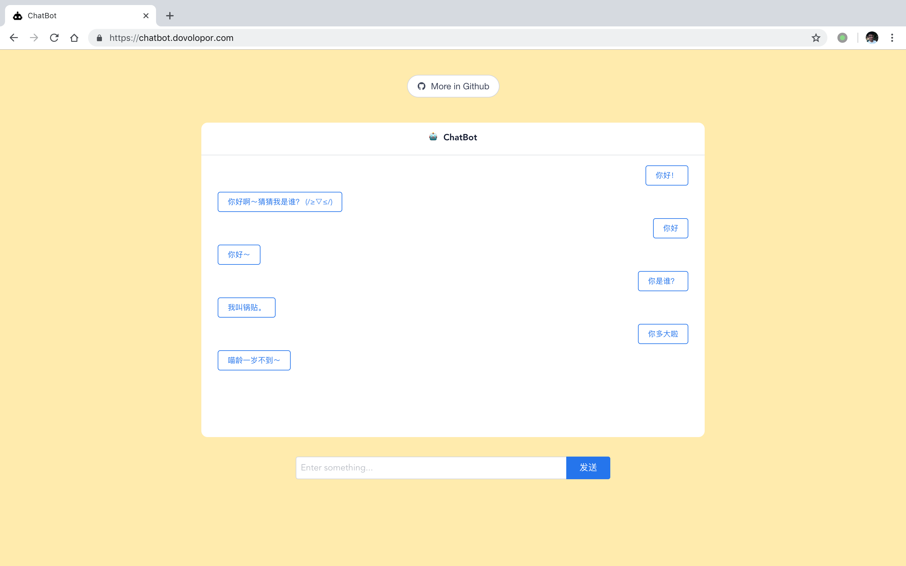

# chatbot

基于 PyTorch 的聊天机器人。

## 1 DEMO



[点我立即尝试 DEMO](https://chatbot.dovolopor.com)

## 2 架构

### 2.1 前端

-   VueJS
-   iView
-   SocketIO

### 2. 后端

-   Flask
-   SocketIO
-   PyTorch

> NOTE: 后端代码基于 [RNN-for-Joint-NLU](https://github.com/applenob/RNN-for-Joint-NLU)进行了改进。

## 3 目录

```shell
.
├── front #前端
│   ├── babel.config.js
│   ├── package.json
│   ├── public
│   ├── README.md
│   ├── src
│   └── yarn.lock
├── back #后端
│   ├── config
│   ├── data
│   ├── model
│   ├── requirements.txt
│   ├── save
│   ├── server.py
│   ├── test.py
│   ├── train.py
│   └── util
├── src # 资源
│   └── images
│       └── readme
├── LICENSE
└── README.md

```

## 4 安装

```shell
git clone https://github.com/HaveTwoBrush/chatbot.git

# 启动后端
cd chatbot/back
python server.py

# 启动前端
cd ../front
yarn
yarn add vue-cli
yarn serve

# 根据提示访问
```

## 5 参考

### 安装

-   [如何安装 python 开发环境？](https://www.v2ai.cn/linux/2018/04/29/LX-2.html)
-   [如何安装 Node 开发环境？](https://www.v2ai.cn/linux/2018/11/11/LX-10.html)
-   [PyTorch 从安装到计算 1+1](https://www.v2ai.cn/ml/2018/08/20/ML-9.html)

### 模型

-   [Tensorflow动态seq2seq使用总结（r1.3）](https://github.com/applenob/RNN-for-Joint-NLU/blob/master/tensorflow_dynamic_seq2seq.md)
-   [Attention-Based Recurrent Neural Network Models for Joint Intent Detection and Slot Filling](https://arxiv.org/abs/1609.01454)

## 6 License

[MIT LICENSE](./LICENSE)

## 7 交流

请添加微信号：`kinggreenhall`，备注「chatbot」，我邀请你进入交流群。
